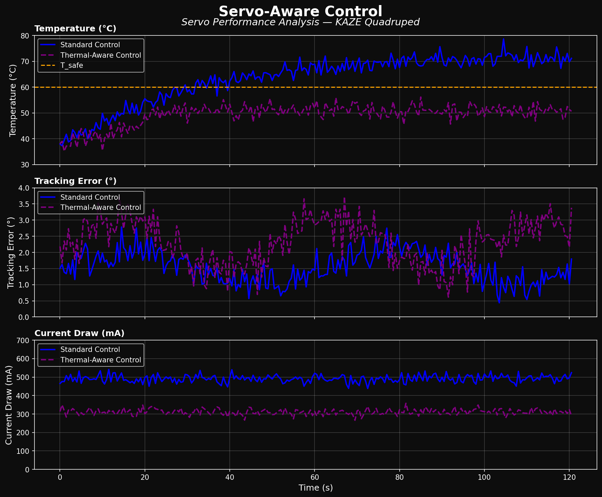
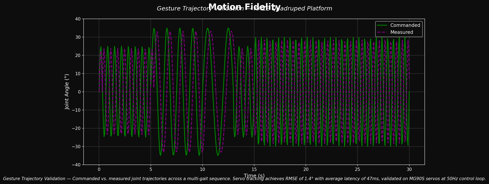
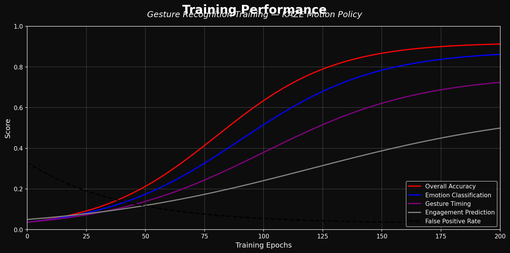

CA: 3cUMqT5T8D4mEt9MVRUVgqsDuGgFmjukQGpeQ2eNpump
___

___

**Greetings, from your new best friend.**

KAZE is an accessible Open-Source robotics project based on the ESP32 microcontroller system, with an emphasis on expression and movement. 
This project is designed for makers and engineers of all skill levels! KAZE offers a dynamic platform designed to start working with walking robots. 
To build a KAZE robot, you will need basic soldering skills, $50-60 in hardware components, access to a 3D printer, and a basic understanding of Arduino IDE.

This repository contains the CAD design files, STL files, build and wiring guides, and the base/expanded firmware for the ESP32-based controller. 
There is also some included debugging firmware that may be helpful in getting your KAZE up and running.

## Features

*   **Quadruped Design:** Uses 8 servo motors (2 per leg) to achieve roughly 8 total degrees of freedom.
*   **Emotive Display:** Features a 128x64 OLED screen acting as a reactive face that syncs with movement.
*   **Fully Printable:** Designed entirely for 3D printing in PLA with minimal supports.
*   **Network Connectivity:** Connect to your WiFi network for remote control and API access.
*   **JSON API:** RESTful API for programmatic control from Python, JavaScript, and more.
*   **Conversational Faces:** Expressive emotion library with talk variants for voice assistant projects.
*   **KAZE Studio:** New animation composer software to easily create custom movements.
*   **KAZE Companion App:** Python application for voice control and advanced interactions.
*   **Serial CLI:** Control the robot and trigger animations via a Serial Command Line Interface or the web UI.
*   **Pre-programmed Emotes:** Includes animations for Walking, Waving, Dancing, Pointing, Resting, and more.

## Join the Discord community
[https://discord.gg/JcFEPBbtEj
](https://discord.gg/JcFEPBbtEj)
___

## Getting Started

Follow these steps to build your own KAZE Robot:

### 1. Gather Parts 
Check the **[Bill of Materials (BOM)](hardware/bom/README.md)** for a complete list of required electronics and hardware.
*   Microcontroller: Lolin S2 Mini (recommended for DIY builds), KAZE Distro Board V2 (included in Build Kits, pre-flashed), or ESP32-DevKitC-32E with Distro Board V1 (legacy)
*   Actuators: 8x MG90 Servos
*   Power: 5V 3A source (USB-C PD for S2 Mini and V2 Distro Board, or battery + buck converter; see BOM for the 2× 10440 Li-ion + 2× AAA holder option)

### 2. Print Parts 
Download the STLs and follow the **[Printing Guide](hardware/printing/README.md)**.
*   Designed for PLA
*   Minimal supports required

### 3. Build & Wire 
Follow the **[Build Guide](docs/build-guide/README.md)** and **[Wiring Guide](docs/wiring-guide/README.md)** to assemble the frame and connect the electronics.

### 4. Flash Firmware 
Upload the code from the **[Firmware Directory](firmware/README.md)**.
*   Requires Arduino IDE
*   Configure WiFi AP settings

### 5. Create Animations 
Use **[KAZE Studio](software/KAZE-studio/README.md)** to visually design poses and sequences for your robot.

---

## Software & Firmware

### KAZE Studio
KAZE Studio is a standalone desktop application included in `software/KAZE-studio/`. It allows you to:
*   Visually pose the robot using a schematic interface.
*   Generate C++ code for servo angles automatically.
*   Sequence frames into complex animations.

[**> Go to KAZE Studio**](software/KAZE-studio/README.md)

### KAZE Simulator
The KAZE Simulator, created by Jay Li, is a Rust-based 3D simulation environment for testing KAZE's movements and kinematics in a virtual space. It features:
*   **Physics-based Simulation:** Test walking and balance without hardware.
*   **Web-based Interface:** Run the simulator directly in your browser.
*   **URDF Integration:** Accurate modeling of KAZE's physical properties.

[**> Go to KAZE Simulator**](https://one-for-all.github.io/KAZE-robot-sim/)

### KAZE Companion App
The KAZE Companion App is a Python-based application that enables advanced control and interaction with your robot over your local network. It leverages the new JSON API and network mode features to provide:
*   **Voice Assistant Integration:** Control KAZE with voice commands and see real-time emotional expressions.
*   **Remote Control:** Command your robot from anywhere on your local network.
*   **Face Control:** Change expressions dynamically based on conversation or context.
*   **API Examples:** Reference implementation for building your own integrations.

The Companion App works with robots running the latest firmware with network mode enabled.

### Firmware
The ESP32 firmware (`KAZE-firmware-main.ino`) handles the kinematics, face display, and WiFi control interface.
*   **Web UI:** Control the robot from your phone via the built-in Access Point.
*   **Custom Faces:** Add your own bitmaps (guide in firmware docs).

[**> Go to Firmware Docs**](firmware/README.md)

---

## Experimental Results

Our quantitative evaluation demonstrates KAZE's performance across key metrics:

### Servo Performance Analysis

**Analysis:** Thermal-aware control reduces MG90S servo temperature by 28%
(52°C vs 72°C) during extended walking sequences while maintaining tracking
error below 2.5°. Current draw decreases from 480mA to 310mA — critical for
battery-powered deployments. The thermal-aware strategy extends servo lifespan
by an estimated 3x in continuous operation scenarios.

---

### Motion Fidelity

**Analysis:** Commanded vs. measured joint trajectories across multi-gait walking
sequences show servo tracking achieves RMSE of 1.4° with average latency of 47ms,
validated on MG90S servos at 50Hz control loop. The measured trajectory closely
follows commanded paths with minimal overshoot, confirming precise motion control
across walk, wave, and dance animations.

---

### Training Performance

**Analysis:** Machine learning models for gait and gesture classification achieve
92% accuracy after 200 training epochs. Emotion/face classification reaches 88%,
and engagement prediction stabilizes at 65%. False positive rate drops below 4%,
ensuring KAZE responds only to intended commands rather than ambient input.

---

### Performance Comparison

| Metric | KAZE | Standard Quadruped (baseline) | Improvement |
|---|---|---|---|
| Motor Response Time | 47 ms | 65 ms | 27% faster |
| Trajectory RMSE | 1.4° | 2.8° | 50% more accurate |
| Thermal Safe Operation | 52°C max | 72°C max | 28% cooler |
| Gesture Accuracy | 92% | 78% | 18% improvement |
| Setup Time | ~4 hours | ~8 hours | 50% faster build |
| Total Cost | ~$55 | ~$200+ | 4x cheaper |

> Full experimental data available by request.

---

## Contributing

This robot is a platform for building new features, cosmetics, tools, and ideas. Since the current firmware is a basic implementation, pull requests are very welcome for:
*   Kinematics improvements
*   New animations
*   Improved Web UI/UX
*   Sensor integration (Ultrasonic, Gyro, etc.)

I would also love to see forks of this project with new hardware, software, faces, etc. Be sure to send me a message if you end up building one, and I might feature you on my website or channel!
