# Build Guide
Complete build guide for the Sesame Robot.

## Phase 1: Gathering all the parts.

Let's start by sourcing all the parts you need to build a sesame robot. There are 11 3D printed parts and 6-8 main electronic components.

### Electronics / Hardware
[Go to full list of electronics & Hardware](../../hardware/bom/README.md)

### 3D Printed Parts
[Go to full list Printed Parts & Guides](../../hardware/printing/README.md)

Here's what a complete set of sesame parts looks like:
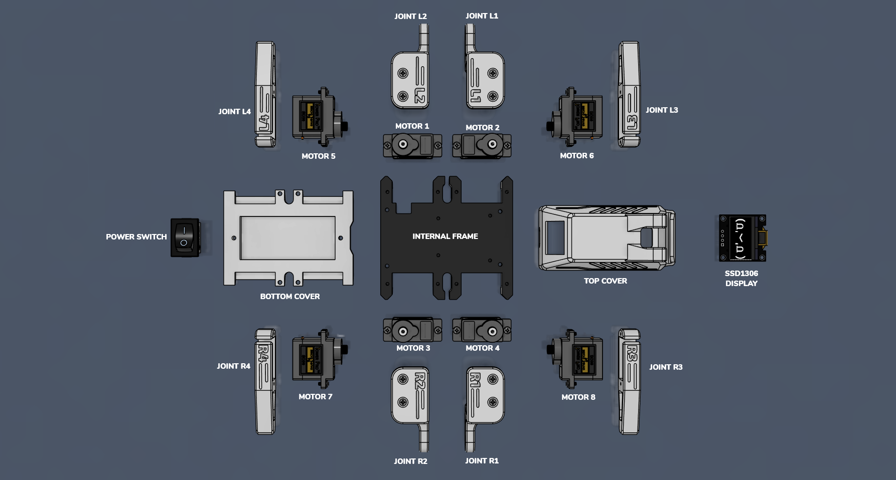

## Phase 2: Electronics and Wiring

After we have all of our parts, we can start by getting the wiring about 90% done, the last bit requires progress on the frame.

Follow the [wiring guide for your specific setup](../wiring-guide/README.md), either the Sesame Distro Board or the Lolin S2 Mini hand-wired setup.

Complete all steps in the wiring guide, but don't connect the power switch, and OLED display just yet. We will wire these in once the board is installed in the frame.

## Phase 3: Hardware Pre-Assembly

### Femur Joints

Now we have our wiring done, we can move on to hardware related tasks. To start, we will do pre-assembly on Sesame's joints.
Locate joints R1, R2, L1, and L2.

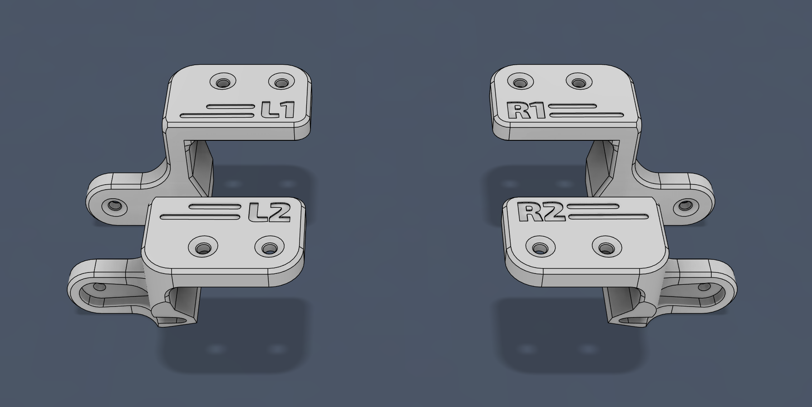

To prepare these joints for later attachment to motors, we will install servo horns into each designated slot. A servo horn is a little plastic arm that can mesh with the servo's geared shaft. The size of the slot in this joint is based on a common one sided servo horn. If your servo horn does not fit, you may have to edit the design, or trim away excess material.

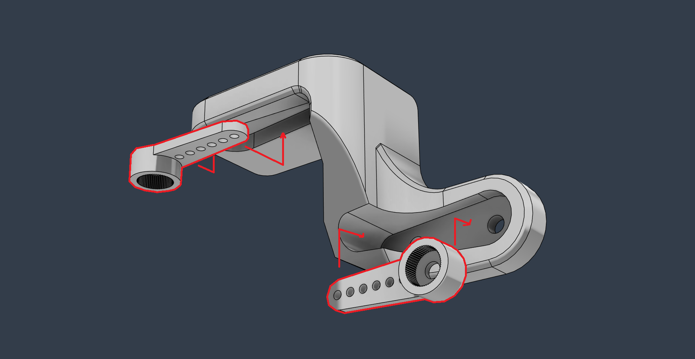

While holding the horn in the slot, use a M2x4mm Self-Threading screw to affix the horn. The mounting holes in the horn are very small, so you may feel resistance as the screw cuts threads into the plastic. This is fine, and is how the horn is held onto the part securely. 

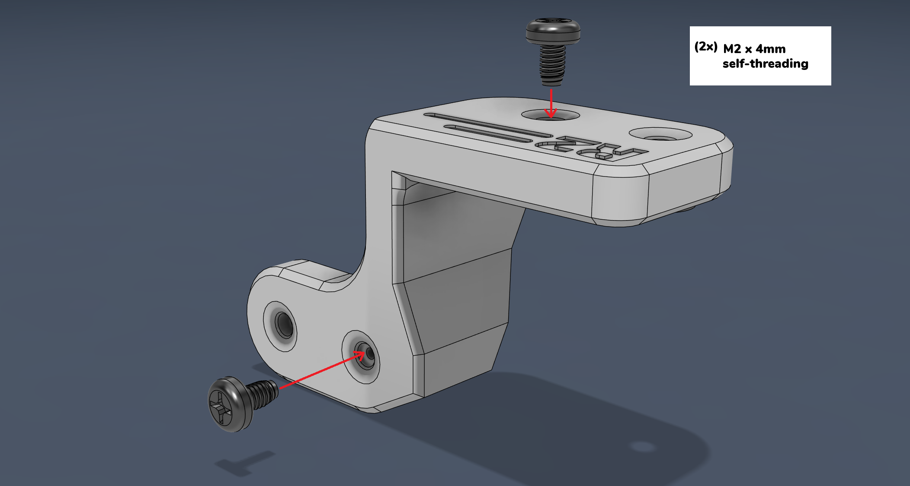

>[!TIP]
> Whenever using self-threading screws, always avoid over-tightening, as the threads are cut from the material that's used and plastic threads will strip easily!

Now we should repeat those two operations on the remaining femur joints. (R1, R2, L1, and L2.)

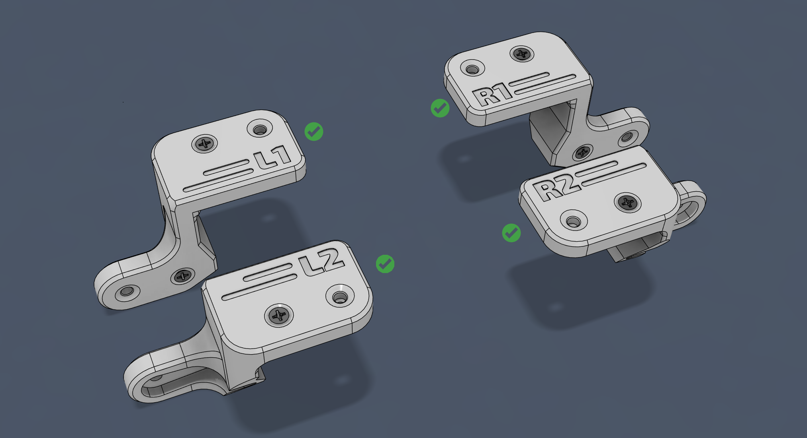

>[!NOTE]
> Even though the servo horns are installed, we don't want to connect the servos to these joints just yet. The motors must be disconnected from any joint during motor calibration, so we will attach them later.

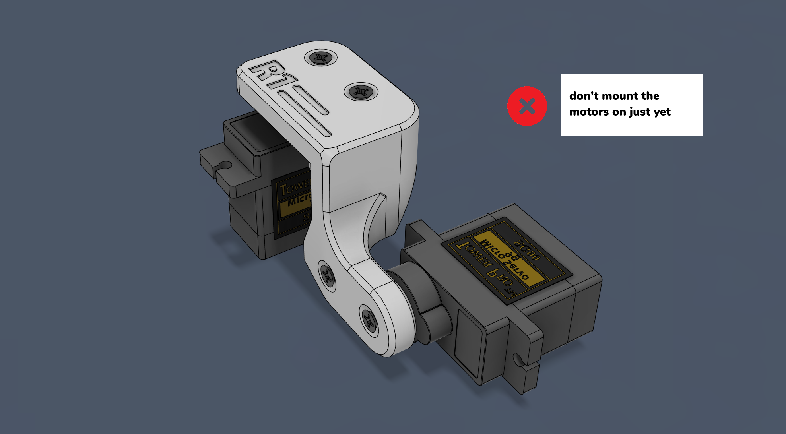

### Foot Joints

Next, we are going to complete all of the feet assemblies by sliding the foot onto the outside of the motors. Notice the small gap designed into the foot joint, this is to allow you to guide the wires. As you slide the motor on, the foot joint will collide with the wires exiting the motor. This is fine, and you can simply push until the foot joint temporarily bends to let the wires through.

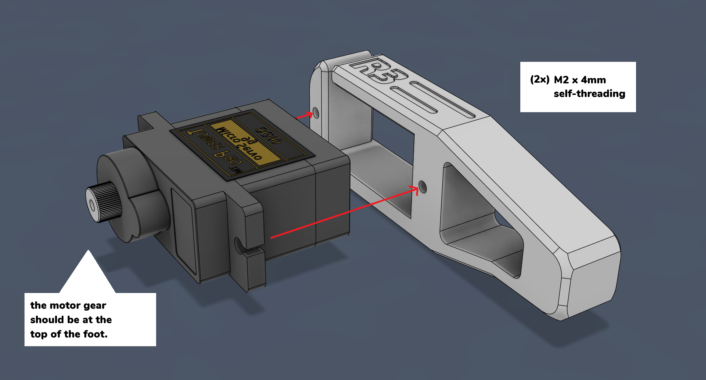

Now we just need to repeat this operation for the remaining foot joints.

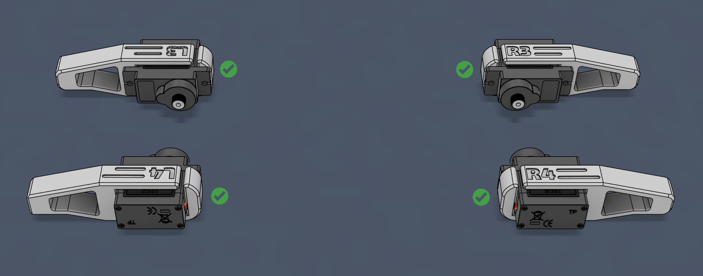

### Top Cover

The third and final part that requires pre-assembly is the top cover.

Start by sliding the OLED display into the dedicated front slot. 

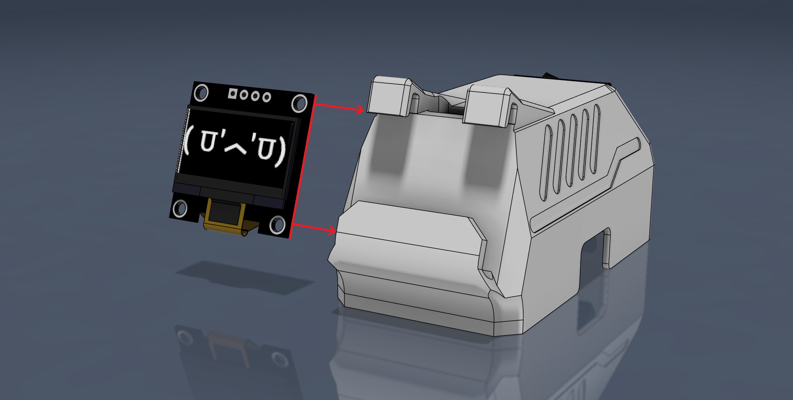

Depending on the model of SSD1306 display you have, the fitment may be slightly loose. If this is the case, locate the internal slots provided and drive two M2x4mm screws in at an angle to secure the display in place. 

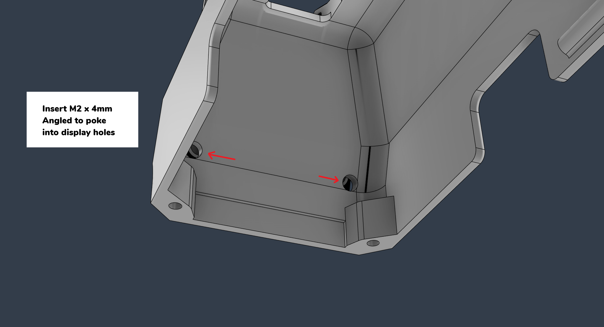

Your display may have included pin headers. To remove these, you can either rest a soldering iron across all four metal pins until the solder melts, and you can pull the headers out. Or you can simply use straight cutting wire snippers to cut the headers flush against the circuit board.

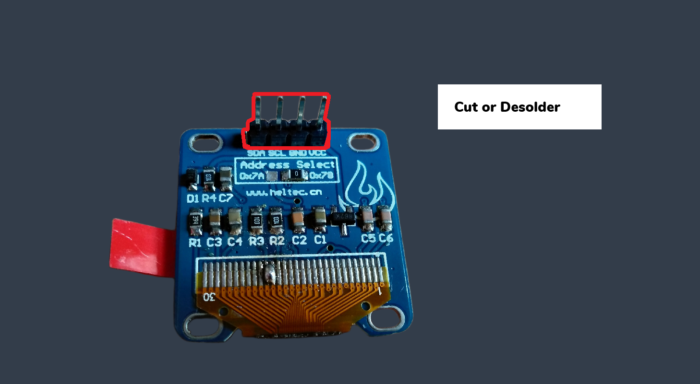

Once the display is secured, we can turn the top cover around and insert the power switch. As listed in the BOM this is a simple two-state rocker switch in a standard size. Apply moderate pressure to press fit the switch into the square cutout. If you are having trouble fitting the switch in the slot, you may need to trim excess material from the outer casing of your switch, as some versions come with extra plastic for some reason.

## Phase 4: Hardware Main Assembly

Next we are going to install the frame motors into the internal frame. To do this we can use a rotating technique. Start by pushing the motor into the slot horizontally.

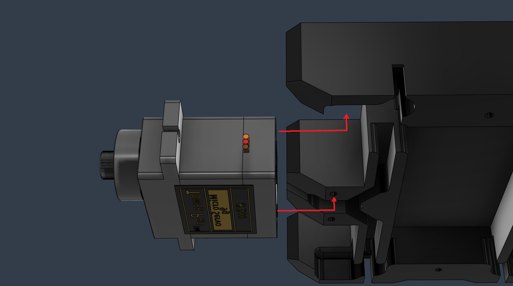

While pushing the motor in horizontally, take care to ensure the wires for the motor end up in their guide slot.

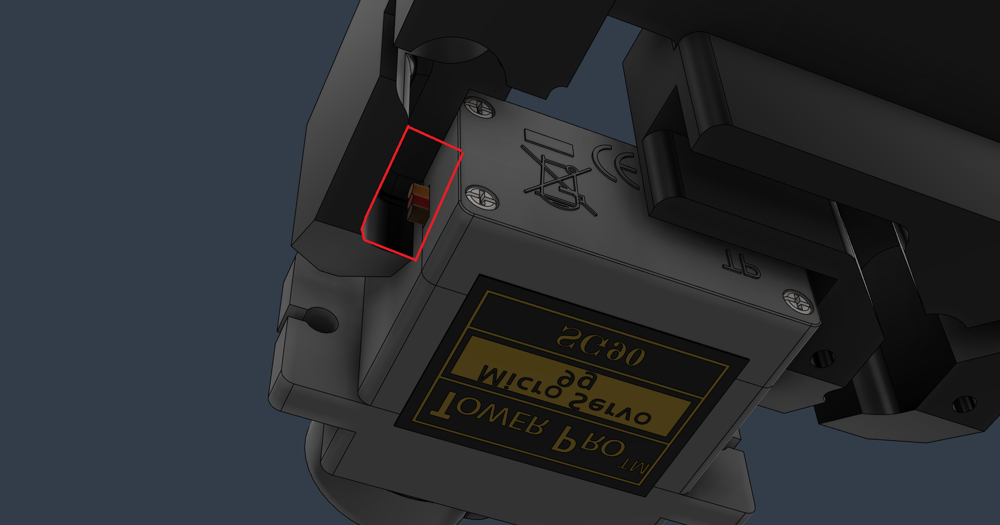

Once in, rotate the motor upwards, making sure the wires are not colliding with the internal frame. 

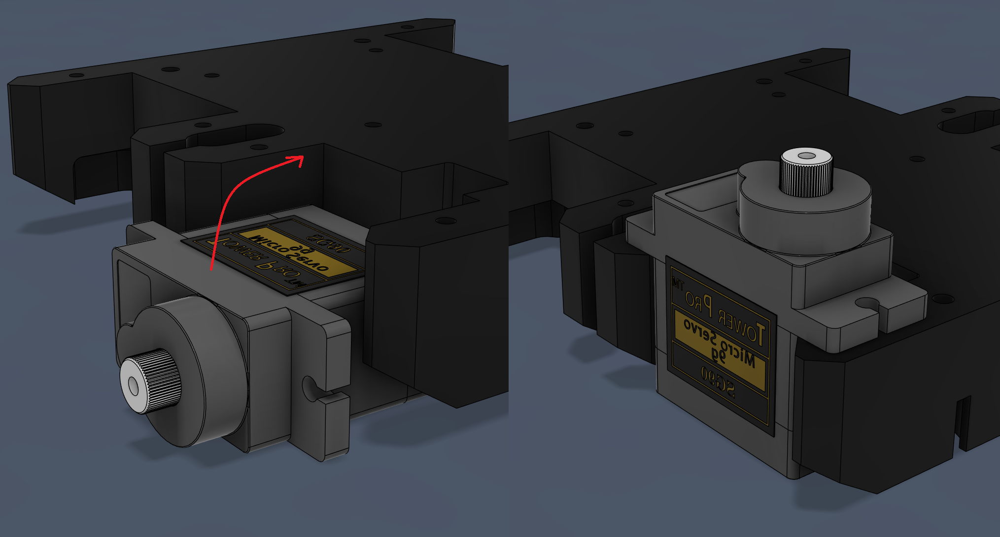

Now we can repeat this rotating operation for all four motors. Make sure the motor shafts are closest to the outer edge of the internal frame, and opposite of each side. Use the same M2x4mm self-threading screws as before to secure all four motors.

### Wire Routing

Now that the frame motors are installed, we can route the wires. There are channels for the wires embedded into the internal frame. Simply guide the wires through the channels and press them in. You may need to use a small tool such as a flat head screwdriver to press the wires in.

I recommend adding a zip tie to bunch up the wires where they exit here, as we don't want them getting in the way while we are installing the remainder of the electronics. 
For now, we will leave the bottom cover removed, so we have the freedom to take the battery or wiggle the motor wires for identification and debugging.

## Installing the Main Electronics

Double check that your electronics are well organized, make sure any stray wires are grouped or shortened. Additionally, make sure wires are connected upwards so they can be routed out of the way, and avoid shorting any connections. 

Gently place your electronics harness into the frame. For the S2 Mini, screw the two screws in to secure the main board. If you used protoboard to make plugging in the servos easier, you can use the excess mounting holes on the internal frame to secure it. 

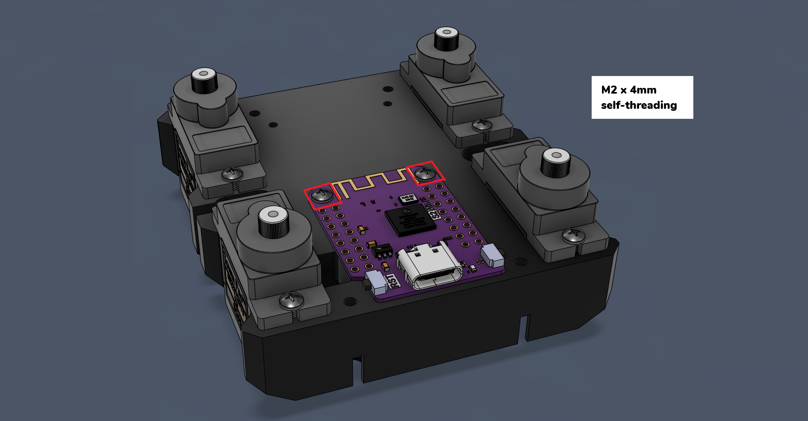

If you are using the Sesame Distro Board, you will need to use stand-offs to raise the screw holes up a specific amount, since the board is a hat on the esp32, and the mounting holes are raised up.

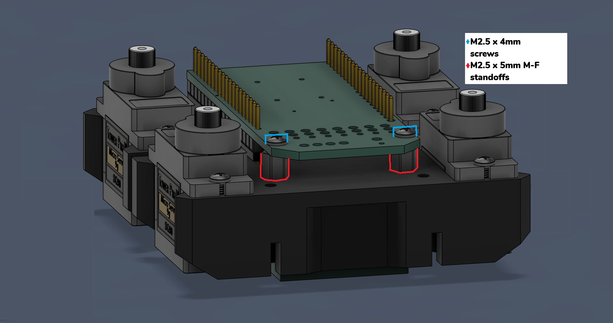

And just like that we are almost ready to start moving around!

>[!TIP]
> If you ever forget which side is the front of the robot before installing the top cover, there is a notch on the front of the internal frame. Additionally, the USB port is always located on the back.

## Calibrating & Running the Testing Firmware

Now that everything is screwed in place, we can test a few important things, and make sure sesame knows the positions of every motor.

Double check that no connections are touching, and if you have exposed wires for the display or power switch, make sure to cover them up.

Now, plug in a high quality USB-C cable into the Microcontroller and into your computer. Using Arduino IDE, flash the "sesame-motor-tester.ino" firmware onto the controller board. If you don't know how to flash firmware onto a board, feel free to search up a tutorial and come back when you've gotten the ropes of it.

Upon flashing the firmware, we should see the board return a list of testing commands we can run over the Serial CLI. Reminder: None of the motors should be plugged in at this point, and they should be disconnected from the horns! Your robot should currently look like a pile of parts. 

The reason we are leaving the motors disconnected for now is because we don't yet know their current positions, so if we set a position and it happens to be outside the range of motion of the joints, we could damage the motors.

>[!CAUTION]
> The motors should not have anything connected to their shafts at this point! I cannot stress this enough it will break your motors if you prematurely attach the joints before calibrating.

Go ahead and set all motors to 90 degrees. Since no motors are plugged in, nothing will happen. Now reference the following guide to identify Motor 0 and its corresponding wire. Make sure you're looking at the robot from the back.

Once you've identified the wire that corresponds with Motor 0, plug it into the connection that leads to the respective pin for Motor 0. On the Sesame Distro Board, this is the topmost plug. If you made your own protoboard setup, it should also be the topmost or bottommost plug if you soldered the data lines in order.

When you plug in this motor, you should hear it quickly whirr into the 90 degree position. Now simply repeat this process for all 8 motors until each one has whirred into place. 

Now the robot knows the positions of all the motors, and we can attach the joints. Notice how when all motors are in the 90 degree position, the robot makes the same pose as in the reference image.

Leaving the robot powered, press the motors gently into the servo horns. Make sure the L1, L2, R2, and R1 text embosses are showing on the top. Without rotating the motors (you shouldn't be able to if they are all powered) press on all of the motors to assemble the legs in this reference configuration.

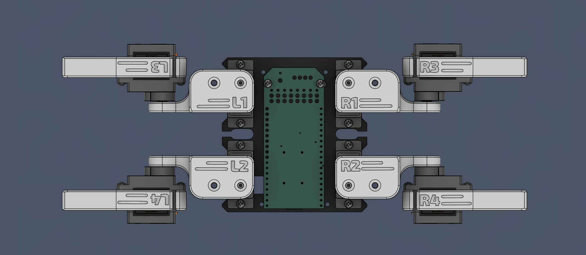

Don't screw the joints onto the motors just yet. First we need to double check our calibration to avoid crashes. To check, we are going to sequentially set motors to a reference angle and see if it actually goes to that reference angle.

Use the Serial Commands on the motor tester firmware to set each motor to its three listed angles in the angle guide (see above), then verify if its behavior matches the expected positions.

Here is a list of common calibration issues and how to solve them:

___
>P: Setting Motor 0, 1, 2, or 3 to a maximum reference angle results in a crash or unexpected behavior.

>S: Verify each motor is plugged into the correct header. Double check your data line leads to the right pin. Sometimes these can get switched due to proximity.
___
>P: Setting Motor 4, 5, 6, or 7 to the straight-down position (usually 180 or 0 degrees) results in a crash or unexpected behavior. 

>S: This may occur because the 90-degree calibration point does not account for direction. If the motor is rotating down into itself and colliding with the bottom of the robot, pull the motor out from the servo horn and set the motor angle to the opposite of straight down (for 6 and 4 this is 180 degrees; for 7 and 5 this is 0 degrees). After you hear the motor whirr into position, push the motor back into the servo horn, but make sure it's pointing straight up. Then run the 90-degree position again to ensure it goes to the center, and repeat the straight-down position to verify it reaches that angle properly. 
___

If you have another issue that is not listed please reach out for assistance!

After calibration is complete, use the provided screws that come with your servos to secure the motors onto the servo horns. If they are not long enough, you can also use M2 machine screws.

## Top Cover and Final Wiring

Now that the motors are calibrated, we can finish our wiring and pack everything in. 

Start by resting the top cover on the joints adjacent to the internal frame. Make sure the display is facing the front of the robot. Then solder the remaining connections to the SSD1306 display and the power switch. Make sure power is disconnected. 

You may need to spend some time methodically bundling the excess wire together. Trust me, jamming it together won't work; I fried multiple boards trying that.

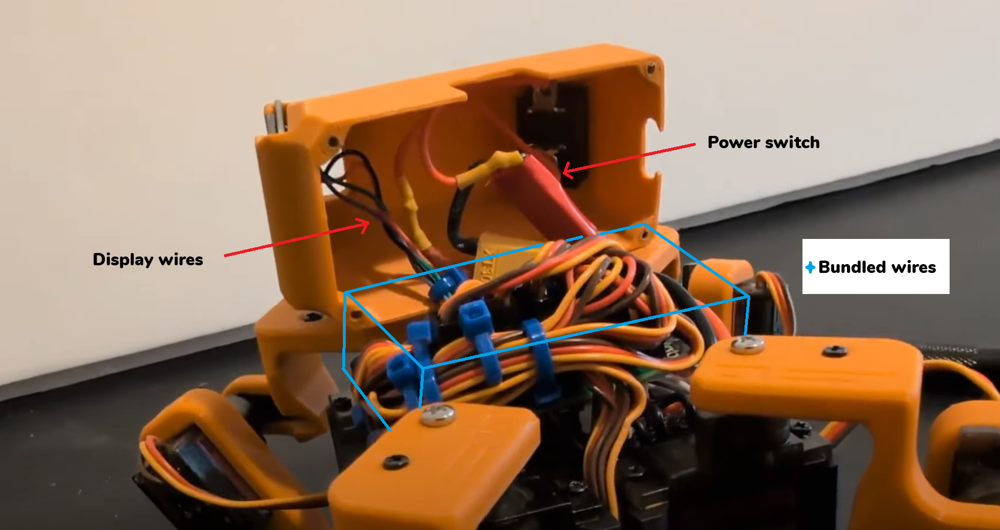

Now that the wiring is done, gently press the top cover over the electronics until it sits flush with the internal frame. This may require some pressure to compress any bundles of wire, but if you are encountering too much resistance, lift the cover back off and check where collisions may be occurring.

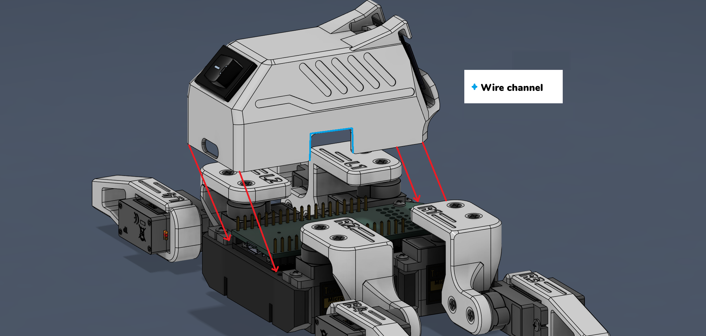

Once the top cover sits flush, insert four M2 x 10mm self-threading screws into the bottom of the internal frame while holding the top cover on. Tighten these screws until they have a small amount of resistance then check to see that the top cover is flush with the internal frame.

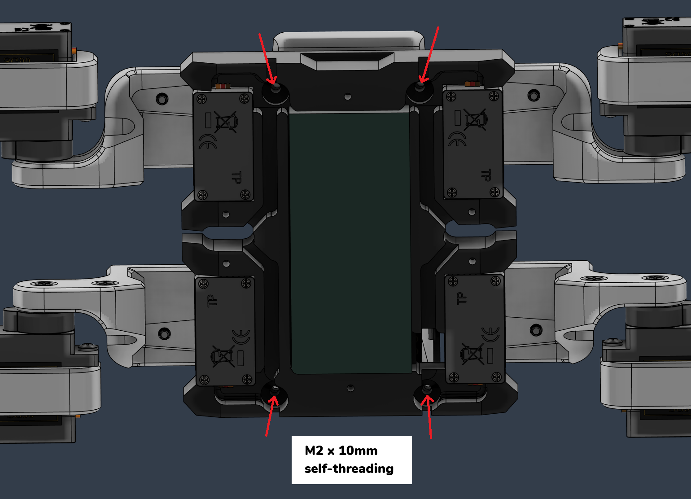

If you have a battery, place it into the bottom of the internal frame. If you would like to use a battery that is a slightly different shape, see the [hardware documentation](../../hardware/README.md) on how you can modify the design for a different battery shape using free online CAD tools. 

*Keep in mind Sesame can work with a tethered power connection if you can't source a battery.*

## Bottom Cover

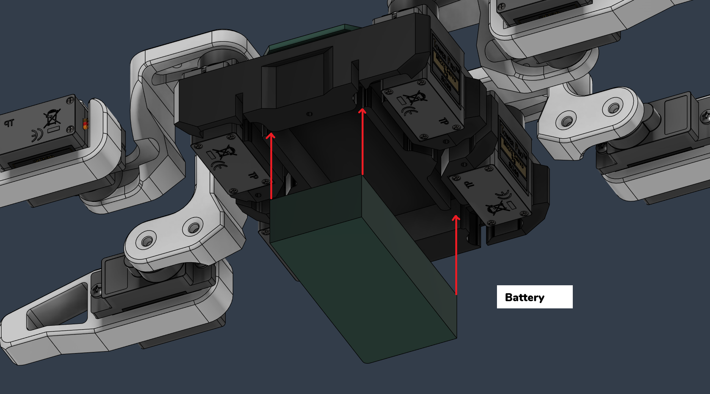

Now route the remaining wires from the outer motors in through the slots on the front and back of the internal frame. Make sure to press the wires in tight so they are flush with the bottom surface.

Now you can place the Bottom Cover over the bottom of the internal frame, making sure no wires are squished in the process.

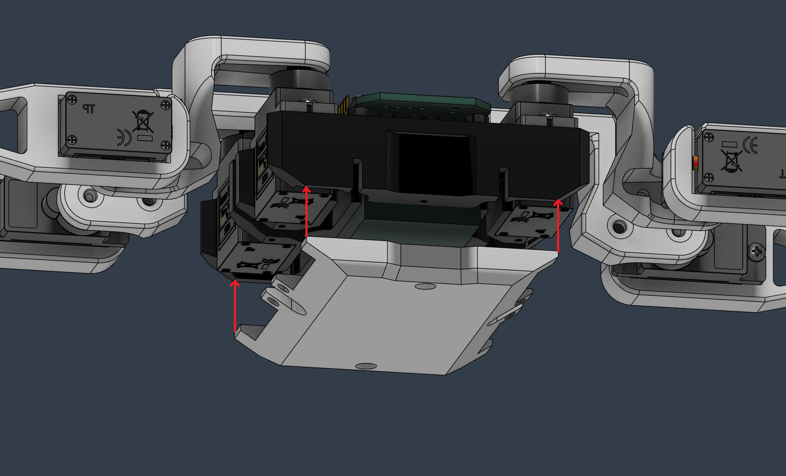

Secure the Bottom Cover with 6 M2 x 10mm self-threading screws.

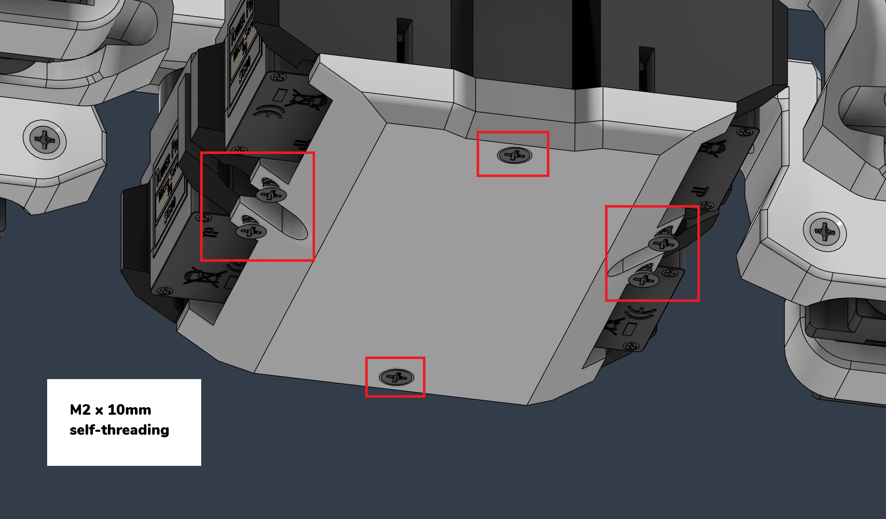

## Final Checks and Flashing the Firmware

Great job! The hardware is complete, now we just need to do a few checks to make sure everything is working and we can flash the firmware onto the microcontroller.

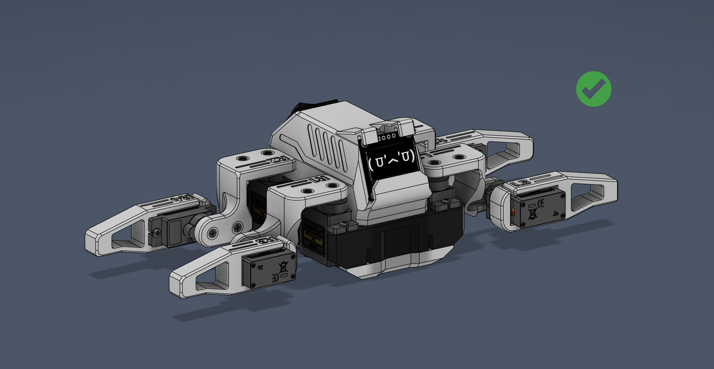

1. Check that the power switch enables and disables the battery. (if applicable)
2. Check that the USB-C Port is not blocked by the top cover.
3. Check that the connections to the display are correct.

Time to flash the firmware. Pick the version that matches your setup; currently there are supported versions for the S2 Mini setup and the Sesame Distro Board setup. If you are using a different board, all you need to do is modify the firmware to respect your unique pin numbers for the motor objects and I2C connection. 

Use Arduino IDE to flash the full firmware including the Face Bitmaps to the ESP32. If you want to learn more about how this firmware actually works, I've gone into great detail in the [firmware documentation](../../firmware/README.md) section on its tech stack. 

Connect to the robot through the AP network and press any pose to verify if the robot is working as intended. You have now officially built your very own Sesame Robot Project!

But this is just the beginning, because there are **tons** of opportunities to customize, improve, and enhance the Sesame Robot Project. 

For making poses, check out [Sesame Studio](../../software/sesame-studio/README.md), and if you want to customize the hardware, see the [hardware documentation](../../hardware/README.md).