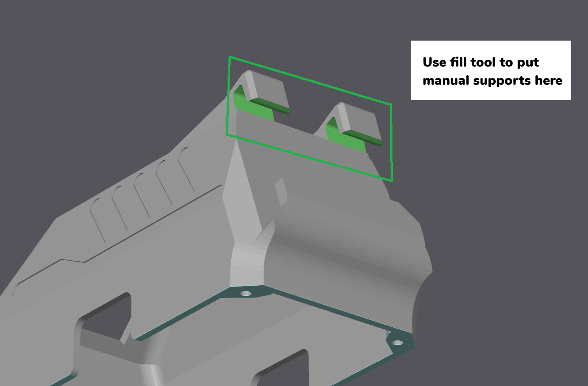
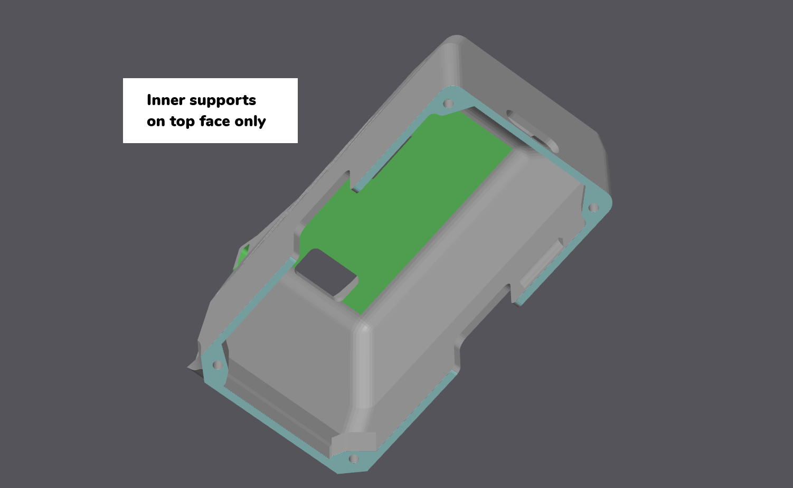
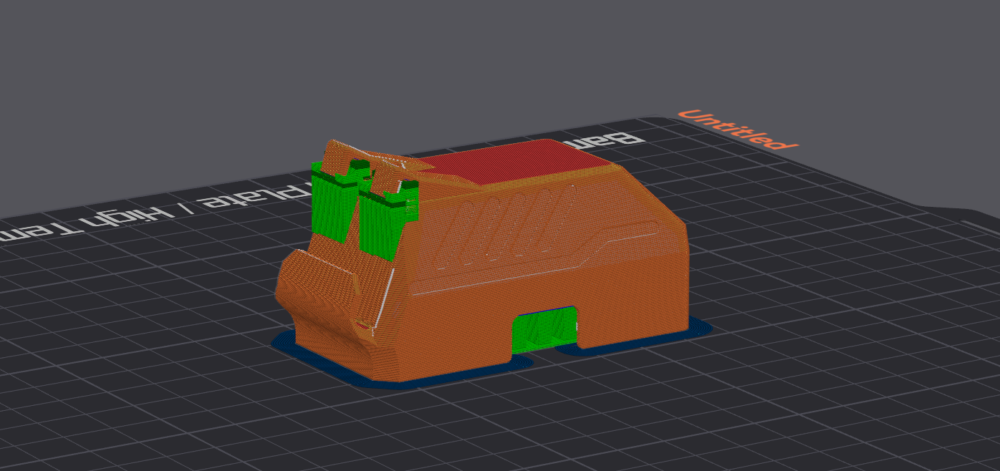
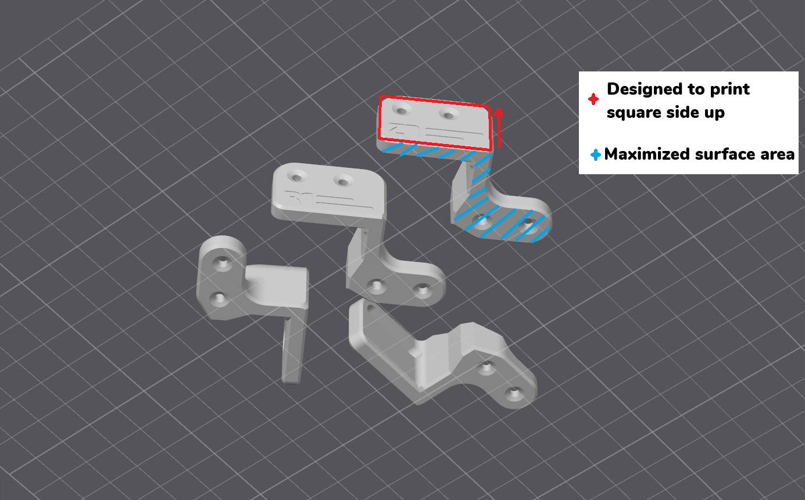

# 3D Printing Guide

Sesame is designed to be printed in **PLA**. Most parts print without supports, but the body cover needs supports in targeted areas. Below is a quick reference for each component:

## Recommended Settings
* **Material:** PLA / PLA+
* **Infill:** 8-10%
* **Wall Loops:** 2
* **Infill Pattern:** Honeycomb

## 3D Printed Components Support Guide

| Component       | Supports Required | Notes                                   |
|-----------------|-------------------|-----------------------------------------|
| Joint R1        | No                | Print flat on build plate.              |
| Joint R2        | No                | Keep orientation consistent.            |
| Joint R3        | No                |                                         |
| Joint R4        | No                |                                         |
| Joint L1        | No                |                                         |
| Joint L2        | No                |                                         |
| Joint L3        | No                |                                         |
| Joint L4        | No                |                                         |
| Internal Frame  | No                |                                         |
| Bottom Cover    | No                |                                         |
| Top Cover       | Yes               | Requires manual supports at overhangs.  |

### Top Cover Settings:

Brim: Outer brim only
Support type: Normal (Manual)

Manual support locations:

This is what the part should look like sliced:

### Recommended Print Orientaiton for Joints:

Using the auto orientate tool will place these the correct way. 

